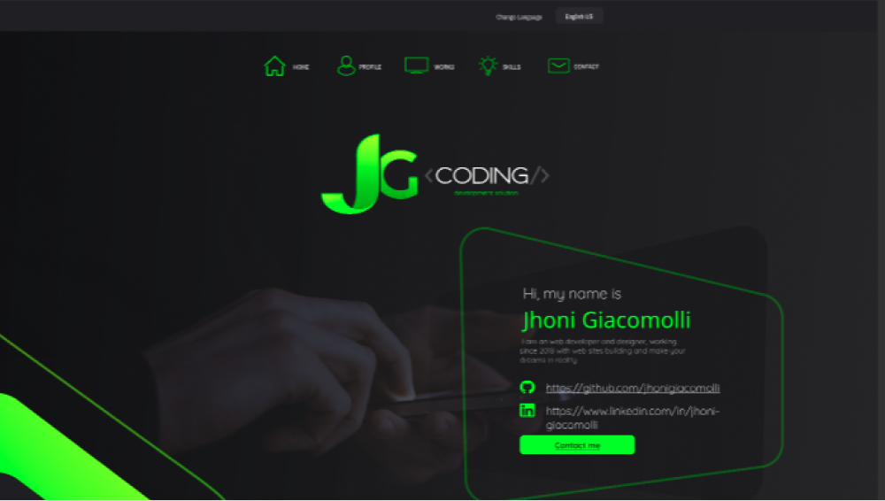
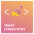

 

> ## Portfolio Project

 

This is one project to display my skills with React.js, Typescript and Styled Components, also as a serve method to show the work I'm doing on the frontend

> ## Features and Tech's

 

###  React.JS
###  Typescript
###  Styled Components
###  HTML
###  CSS